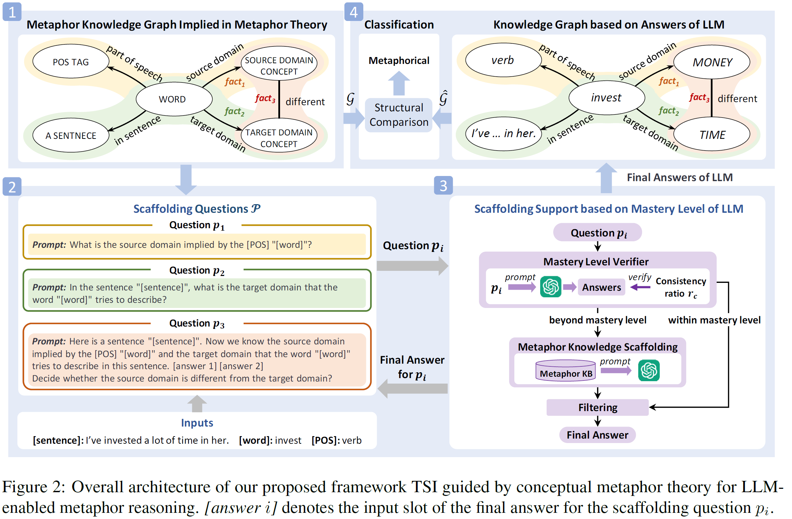

# A Theory Guided Scaffolding Instruction Framework for LLM-Enabled Metaphor Reasoning 
This repository contains codes for **T**heory guided **S**caffolding **I**nstruction (TSI) framework for LLM-enabled metaphor reasoning, described by the paper *A Theory Guided Scaffolding Instruction Framework for LLM-Enabled Metaphor Reasoning* accepted by NAACL 2024.
## Quick links
- [A Theory Guided Scaffolding Instruction Framework for LLM-Enabled Metaphor Reasoning](#a-theory-guided-scaffolding-instruction-framework-for-llm-enabled-metaphor-reasoning)
  - [Quick links](#quick-links)
  - [Overview](#overview)
  - [Setup](#setup)
    - [Install dependencies](#install-dependencies)
    - [Datasets](#datasets)
  - [Model](#model)
  - [Citation](#citation)
  - [References](#references)
  - [Acknowledgements](#acknowledgements)

## Overview

In this work, we present a novel **T**heory guided **S**caffolding **I**nstruction (TSI) framework for LLM-enabled metaphor reasoning. Please find more details of this work in our paper.

## Setup

### Install dependencies
Please install all the dependency packages using the following command:
```
pip install -r requirements.txt
```

Please get OpenAI API Key from https://platform.openai.com/account/api-keys

Please download the t5-3b model from [t5-3b](https://huggingface.co/google-t5/t5-3b) and put all the files in the folder `t5-3b/`. 
### Datasets
Our experiments are based on sampled MOH and TroFi datasets, which are in the folder `data/`. Please refer to our paper for more details about these datasets. 


## Model

The scripts for our methods guided by selection preference violation (SPV) (Wilks, 1975, 1978), metaphor identification procedure (MIP) (Pragglejaz Group, 2007), and conceptual metaphor theory (CMT) (Lakoff and Johnson, 1980) are in the folder `SPV_scripts/`, `MIP_scripts/`, `CMT_scripts/`,  respectively. The scripts to calculate the textual similarity score of the answer pair are the files `scripts\3-1ans_2ans_sim_score_for_CMT_and_MIP.py` and `scripts\3-1ans_sim_score_for_SPV.py`.


## Citation

If you find this repo useful for your research, please consider citing our paper.

```
@inproceedings{metaphorreasoning2023,
  author    = {Tian, Yuan and
               Xu, Nan and
               Mao, Wenji},
  title     = {A Theory Guided Scaffolding Instruction Framework for LLM-Enabled Metaphor Reasoning},
  booktitle = {Proceedings of the Conference of the North American Chapter of the Association for Computational Linguistics},
  publisher = {Association for Computational Linguistics},
  year      = {2024}
}
```

## References
Yorick Wilks. 1975. A preferential, pattern-seeking, semantics for natural language inference. Artificial Intelligence, 6(1):53–74.

Yorick Wilks. 1978. Making preferences more active. Artificial Intelligence, 11(3):197–223.

Pragglejaz Group. 2007. MIP: A method for identifying metaphorically used words in discourse. Metaphor and Symbol, 22(1):1–39.

George Lakoff and Mark Johnson. 1980. Metaphors we live by. University of Chicago Press.

## Acknowledgements

Thanks for the datasets from https://github.com/SilasTHU/MisNet

The license of MOH-X dataset is available at https://saifmohammad.com/WebPages/SentimentEmotionLabeledData.html

The license of TroFi dataset is available at https://www2.cs.sfu.ca/~anoop/students/jbirke/LICENSE.html

Thanks for the T5 model from https://huggingface.co/google-t5/t5-3b


